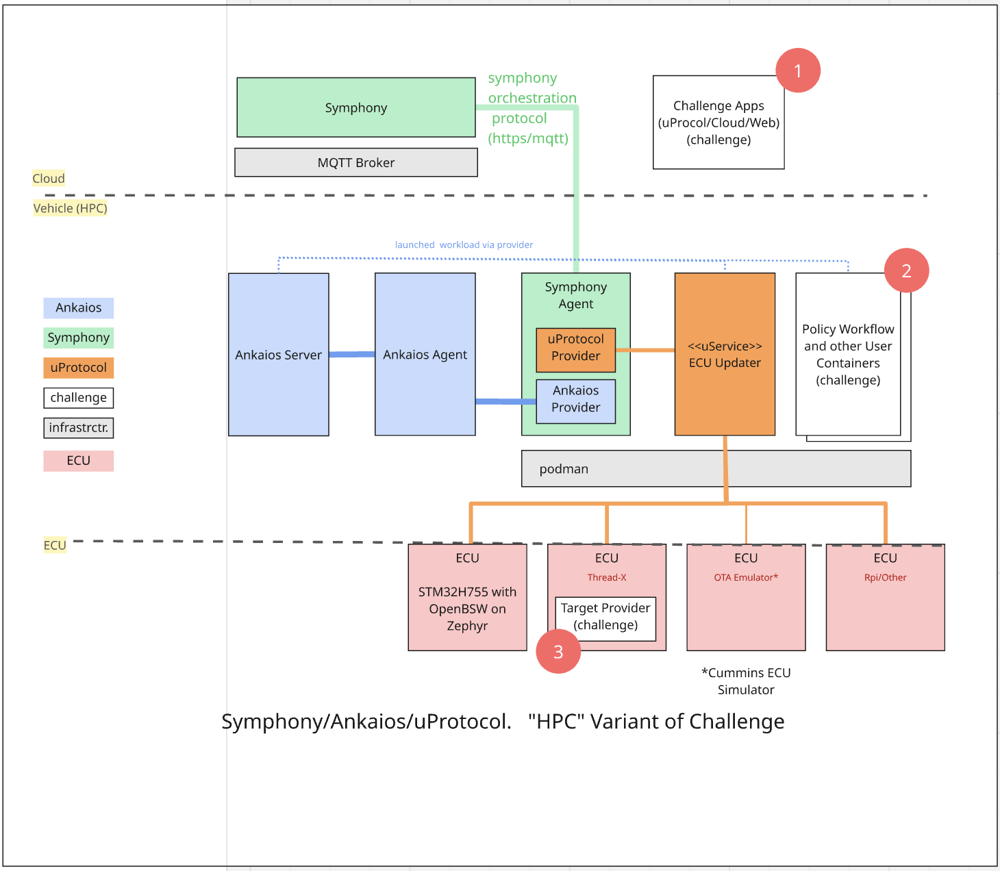
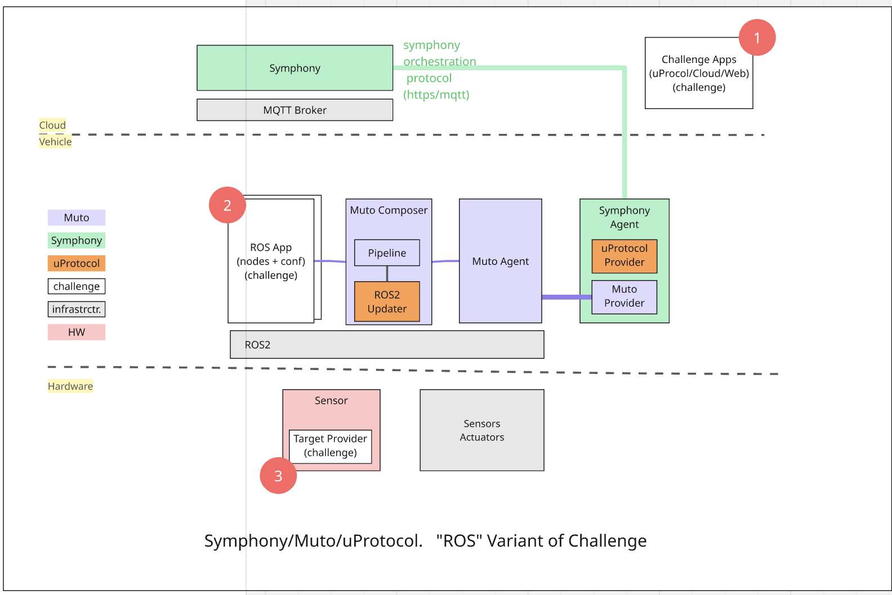

# Mission: Update Possible 🚗⚡

## The Challenge
Modern vehicles aren’t just engines and wheels anymore — they’re powerful, software-driven platforms with dozens of interconnected ECUs, sensors, and services. But delivering secure, reliable Over-the-Air (OTA) updates at scale? That’s still a big challenge. Update Possible invites you to take on one of the hottest technical problems in the software-defined vehicle world: designing an open, end-to-end OTA update system using cutting-edge tools like [Eclipse Symphony](https://github.com/eclipse-symphony/symphony)
, [Eclipse uProtocol](https://uprotocol.org/), and in-vehicle orchestrators such as [Eclipse Ankaios](https://eclipse-ankaios.github.io/ankaios/) and [Eclipse Muto](https://github.com/eclipse-muto).

## Your mission:
* Build a working prototype that pushes updates from a cloud orchestrator to simulated vehicles.
* Leverage open technologies to coordinate, deliver, and verify updates.
* Tackle advanced scenarios like multi-site rollouts, rollback on failure, and first-time provisioning.

This challenge is inspired by real-world regulations like UN R155 and R156, which demand secure, traceable, and auditable software update processes — especially for commercial and industrial fleets.
We’ll provide starter templates, simulated agents, and reference uServices to get you moving fast. Whether you’re a cloud-native developer, embedded engineer, or systems architect, this is your chance to
Work hands-on with open automotive tech

## OTA Updates for ECUs

#### Challenge Summary
This challenge tasks participants with building a secure, scalable Over-the-Air (OTA) update system for automotive ECUs using open-source Eclipse technologies. The goal is to simulate real-world scenarios where software updates must be delivered, coordinated, and verified across multiple vehicle components, in compliance with regulations like UN R155 and R156.

**Key Technologies:**
- **Eclipse Symphony:** Orchestrates the overall update process, integrating cloud and vehicle services for seamless management of software-defined vehicles.
- **Eclipse uProtocol:** Provides secure, interoperable communication between vehicle ECUs and services, ensuring updates are delivered reliably and traceably.
- **Eclipse Ankaios:** Acts as the in-vehicle orchestrator, managing workloads and containers on High Performance Computing (HPC) platforms, and executing update operations on target ECUs.

**Challenge Outline:**
- Design an end-to-end OTA update workflow from cloud to vehicle.
- Implement multi-site rollouts, rollback on failure, and first-time provisioning.
- Use simulated agents and reference uServices to demonstrate update delivery and verification.
- Ensure the solution meets security, traceability, and auditability requirements for automotive fleets.

This HPC variant focuses on updating ECUs in a simulated vehicle environment, leveraging the strengths of Symphony, uProtocol, and Ankaios to create a robust and open OTA update system.

### OTA with Eclipse Ankaios

To run the OTA variant with the Eclipse Ankaios embedded software orchestrator, please follow the instructions of the [README.md](./ankaios/README.md) inside the `ankaios` folder.

## OTA Updates for Robots

This robotics flavored "ROS" variant of the challenge invites you to use [Eclipse Symphony](https://github.com/eclipse-symphony/symphony)
, [Eclipse uProtocol](https://uprotocol.org/), and in-vehicle orchestrator [Eclipse Muto](https://github.com/eclipse-muto).  

#### Challenge Summary
This robotics (ROS) variant of the challenge focuses on orchestrating secure, scalable OTA updates for robotic platforms using open Eclipse technologies. The goal is to demonstrate how software updates, provisioning, and policy-driven workflows can be managed across fleets of robots, leveraging Symphony, uProtocol, and Muto.

**Key Technologies:**
- **Eclipse Symphony:** Acts as the central orchestrator, managing update workflows, device provisioning, and monitoring across distributed robotic fleets.
- **Eclipse uProtocol:** Enables secure, interoperable communication between robotic components, orchestrators, and services, supporting reliable update delivery and telemetry.
- **Eclipse Muto:** Serves as the in-robot orchestrator, handling ros workspaces, ros nodes and configurations, update execution, and policy enforcement on robotic hardware.

**Challenge Outline:**
- Design an end-to-end OTA update workflow for robots, from cloud orchestrator to robotic hardware.
- Implement policy-driven updates (e.g., only update when robot is idle or in a safe state).
- Demonstrate multi-site distribution, partial updates, rollback, and device provisioning.
- Use simulated agents and uServices to showcase update delivery, verification, and telemetry reporting.
- Ensure the solution meets security, traceability, and auditability requirements for robotic fleets.

This ROS variant highlights the flexibility and power of Symphony, uProtocol, and Muto in managing complex update scenarios for robotics platforms, enabling safe, reliable, and auditable software delivery.

---
### Eclipse Projects Referenced
- [Eclipse Symphony](https://github.com/eclipse-symphony/symphony)
- [Eclipse uProtocol](https://uprotocol.org/)
- [Eclipse Ankaios](https://eclipse-ankaios.github.io/ankaios/)
- [Eclipse Muto](https://github.com/eclipse-muto)

#### Challenge Levels & Use Cases

**1. End-to-End OTA Application & User Experience**
- Build a demo application (web or mobile) that showcases the full OTA update workflow.
- The app interacts with vehicles via Symphony REST APIs and uProtocol, visualizing update status, telemetry, and fleet management.
- Example use case: A dashboard lets users trigger updates, monitor progress, and view real-time telemetry from simulated vehicles.

**2. Policy Workflow & User Containers**
- Implement policy-driven workflows and user-defined containers.
- Example challenge: Ensure updates only occur when the vehicle is parked and not running, using Symphony and uProtocol to enforce policies.
- Use case: A policy engine checks vehicle state before allowing updates, and can be extended to other conditions (battery level, location, etc.).

**3. ECU Firmware Update & Hardware Integration**
- Perform actual firmware updates on ECUs, requiring knowledge of hardware, RTOS, and uProtocol.
- Example challenge: Use uProtocol to deliver and verify firmware updates on simulated or real ECUs (Thread-X, Raspberry Pi, Docker containers).
- Use case: The update process interacts directly with the ECU, handles low-level operations, and reports status back to the orchestrator.

**Additional Use Cases:**
- **Basic OTA Update Orchestration:** Use Symphony to push updates to multiple vehicles (simulated by uService instances), define packages, distribute, and monitor status. Add telemetry for update progress.
- **Multi-Site OTA Distribution:** Central orchestrator distributes updates to regional installations (e.g., Berlin, Porto), which then push updates to local fleets. Demonstrates geographic deployment management.
- **Partial Update & Rollback:** Implement partial OTA updates; if issues are detected, initiate rollback using uProtocol for granular control and status reporting.
- **Device Provisioning & Initial Configuration:** Use Symphony and uServices to provision new vehicles, deploy initial configurations, and prepare them for future OTA updates.

### Getting Started

- Follow intructions [here](./symphony/README.md) to set up Eclipse Symphony using Docker Compose with a single command line.

- Use the instructions [ROS2 Provider](./muto/muto.md) to set up and of Eclipse Muto with Eclipse Symphony ROS 2 Provider
