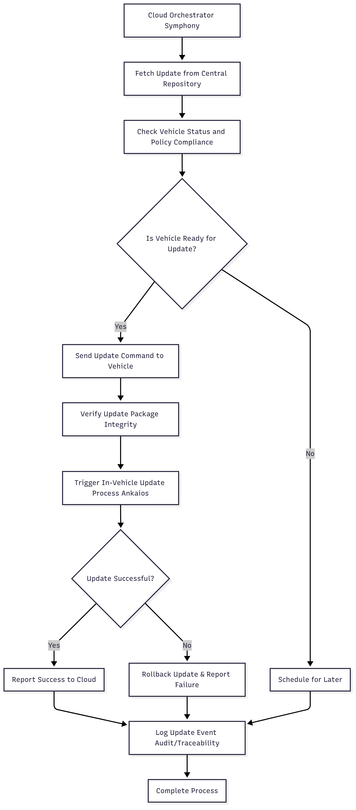

# SolutionPlan

## 1. Your Team at a Glance

**Team Name / Tagline**  
**YTU-MINT**  
*A dynamic team of Yildiz Technical and Eskisehir Technical University students, alongside a Berlin-based developer, uniting to bridge innovation across borders.*

*Visual: Create a sheet of paper with your team name on the desk, or include a team logo/image.*

### Team Members  
| Name | GitHub Handle | Role(s) |
|-------|---------------|---------|
| Kaan Özarslan | [kaanoz1](https://github.com/kaanoz1) | Team Lead |
| Arda Eren Mike | [ardamayk](https://github.com/ardamayk) | Developer |
| Şevval Gizem Kırbaş | [svvlgizem](https://github.com/svvlgizem) | Developer |
| Burak Oflaz | [burakoflaz](https://github.com/burakoflaz) | Developer |
| Ibrahim Ethem Topcu | [iethem](https://github.com/iethem) | Developer |

### Challenge  
**Update Possible / OTA Updates for ECUs**

### Core Idea 

---

## 2. How Do You Work

### Development Process  
1. **Plan**: Define update workflow, security, and compliance requirements.  
2. **Design**: Architect the system (cloud-to-vehicle) using Symphony, uProtocol, and Ankaios.  
3. **Implement**: Develop orchestrator, update policies, and vehicle communication modules.  
4. **Test**: Simulate updates, rollback, and multi-site rollouts in a controlled environment.  
5. **Deploy**: Deliver updates securely, verify integrity, and monitor progress.

### Planning & Tracking  
- Use **GitHub** for task management.  
- Prioritize tasks and track progress using **burndown charts**.

### Quality Assurance  
- Manual testing to ensure features meet expected quality standards.  
- Document all processes and code for transparency.

### Communication  
- Daily meetings to discuss progress, blockers, and next steps.  

### Decision Making  
- Consensus-based decisions during meetings.  
- Team Lead provides final input when consensus cannot be reached.
