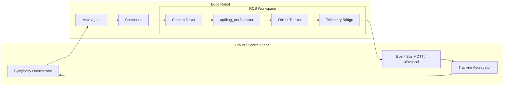
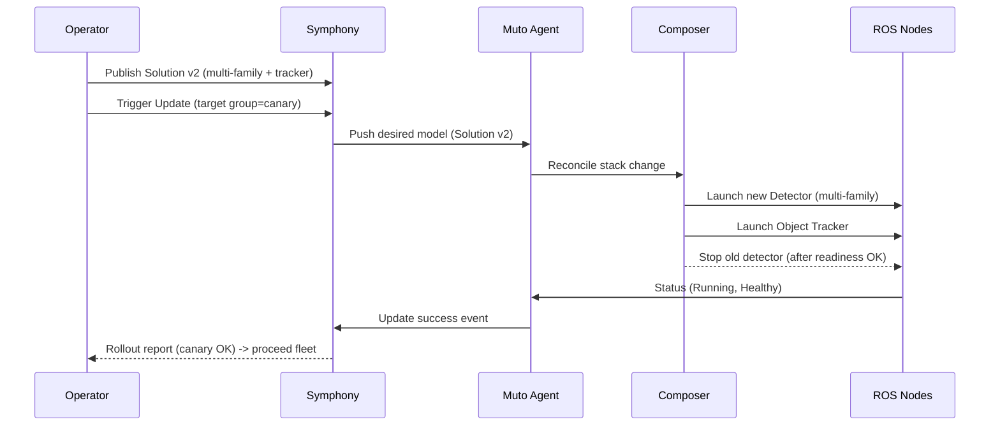

# ROS Apriltag Detector


This example uses  holds the following [AprilTag ROS2 Packages](https://github.com/ros-misc-utilities/apriltag_detector): packages for detecting and displaying [Apriltags](https://april.eecs.umich.edu/software/apriltag). Please read the [documentation](https://github.com/ros-misc-utilities/apriltag_detector/blob/master/README.md) there for further details.


The software in this repository does strictly perception, *no camera pose estimation*!
It is typically used when no camera calibration is available, or is not needed.
If you want perception and camera pose together, use [this package](https://github.com/christianrauch/apriltag_ros),
which uses the same tag message format.

## Installation

### From packages

```
apt install ros-${ROS_DISTRO}-apriltag-detector ros-${ROS_DISTRO}-apriltag-draw \
            ros-${ROS_DISTRO}-apriltag-detector-umich ros-${ROS_DISTRO}-apriltag-detector-mit
```

## Robotics OTA Use Case: AprilTag Detection & Tracking

This section turns the general "OTA Updates for Robots" challenge into a concrete, end‑to‑end example you can implement, extend, and use to demonstrate update orchestration with Symphony + Muto.

### 🎯 Scenario Summary
You operate a fleet of mobile robots equipped with a monocular camera. Each robot runs an AprilTag detection pipeline (based on the open source `apriltag_ros` package) to identify fiducial markers in the environment. A central tracking uService aggregates detections from many robots to build a shared situational model (e.g., tagged pallets, tools, shelves, or docking stations).

Version 1 (Baseline):
- Detects a single AprilTag family (e.g., `tag36h11`).
- Publishes raw tag detections (pose + ID) to a ROS topic.
- Sends periodic heartbeat + basic telemetry (CPU, image FPS).

Version 2 (Update):
- Enables multi‑family detection (`tag36h11` + `tagStandard41h12`).
- Adds per‑tag confidence scoring & smoothing.
- Introduces an Object Tracker node that maintains temporal state (disappeared / newly appeared / stable objects) and publishes events.
- Adjusts detection parameters (quad decimation, blur) for performance.
- Ships new policy: only update while robot is docked (battery policy enforcement via Symphony attributes & Muto labels).

The OTA Update Flow:
1. Fleet is on v1 (single family) running stably.
2. New v2 stack (multi‑family + tracker) is published as a new Symphony Solution version + Muto stack revision.
3. Operator (or automated policy) requests OTA update on a subset (canary) of robots.
4. Symphony coordinates delivery → Muto Agent reconciles model → Composer rolls out new nodes with minimal downtime.
5. Telemetry + status events confirm success; system promotes rollout to the rest of the fleet or rolls back on failure.

### 🧩 High-Level Architecture



<details>
<summary>Plaintext architecture (fallback if Mermaid not rendered)</summary>

Cloud / Control Plane:
   - Symphony Orchestrator
   - Update Registry (Target/Solution/Instance)
   - MQTT / uProtocol (Events & Commands)
   - Tracking Aggregator (Fleet Tag Map)

Edge Robot:
   - Muto Agent (receives model)
   - Composer (enforces stack)
   - ROS Workspace:
         * Camera Driver Node -> apriltag_ros Detector -> Object Tracker -> Telemetry Bridge

Flows:
   Symphony -> Muto Agent -> Composer -> Camera -> Detector -> Tracker -> Telemetry -> Cloud events
   Update Registry -> Composer
   Tracking Aggregator feedback -> Symphony

</details>

### 🔄 OTA Sequence (Baseline → Updated Stack)



### 🗂️ Symphony Artifact Examples

Below are illustrative (minimal) JSON/YAML fragments. Adapt field names to match the current Symphony API version.

#### 1. Target Definition (`target.json`)


#### 2. Solution (v1) – Single Family (`solution-v1.json`)


#### 3. Solution (v2) – Multi Family + Tracker (`solution-v2.json`)


#### 4. Update Request (Canary)
```jsonc
{
   "apiVersion": "symphony/v1",
   "kind": "UpdateRequest",
   "metadata": { "name": "apriltag-tracking-rollout-200" },
   "spec": {
      "solutionRef": { "name": "apriltag-tracking", "version": "2.0.0" },
      "selector": { "matchLabels": { "fleet": "warehouse-a" } },
      "strategy": { "type": "Canary", "steps": [ { "size": 3 }, { "pause": true }, { "allRemaining": true } ] }
   }
}
```

### 🛠️ Muto Stack Model Example (`muto.yaml` excerpt)
Below shows how the same system might be modeled for the Muto Composer. (Field names illustrative; align with actual Muto schema.)
```yaml
```

Update variant (v2)—only changed lines shown:
```diff
 
```

### 🚀 ROS 2 Launch File (Detector + Tracker)
`apriltag_tracking.launch.py` (simplified):
```python

```


### 📡 Telemetry & Status Events
Recommended topics / messages:
- `/apriltag/detections` – raw detections


### 🔐 Policy Enforcement Ideas
- Require `docked=true` (battery safe) before allowing update.
- Enforce max CPU utilization < threshold before rollout (pre-flight check).
- Canary group = first 5% of targets (Symphony strategy).
- Automatic rollback if >10% of updated nodes report degraded detection FPS.

### 🧪 Test / Validation Steps
1. Deploy v1 to a simulated robot (e.g., Gazebo + static AprilTag board).
2. Verify single family detection.
3. Publish Solution v2 + create UpdateRequest (canary).
4. Confirm new environment variables applied (multi-family topics populated).
5. Validate tracker events appear (`APPEARED`, `UPDATED`, `LOST`).
6. Scale rollout → full fleet.
7. Induce fault (remove camera stream) → confirm restart & no infinite loop.
8. Measure detection latency before/after (optional KPI).


### 🧬 Variation & Extension Ideas
- Add depth camera & 3D pose refinement node.
- Introduce semantic fusion with fiducial + QR code pipeline.
- Add policy: block update if active mission state = "Executing".
- Integrate uProtocol native pub/sub instead of MQTT bridge.
- Use hardware acceleration (e.g., GPU build of AprilTag library) as v3 update.

### 📓 Notes
- JSON/YAML schemas above are illustrative—synchronize with actual Symphony & Muto versions.
- For real hardware, add camera device plugin .
- Consider signing container images & verifying signature pre-deployment for security (UN R155/R156 alignment).

---
This reference use case is intentionally modular so teams can substitute perception algorithms, add safety constraints, or explore advanced rollout strategies while keeping a clear baseline scenario.

